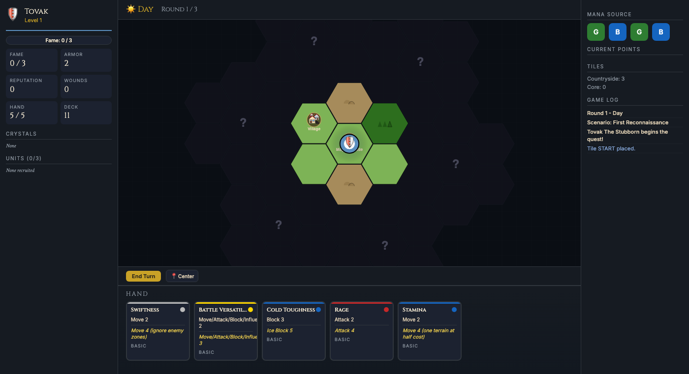
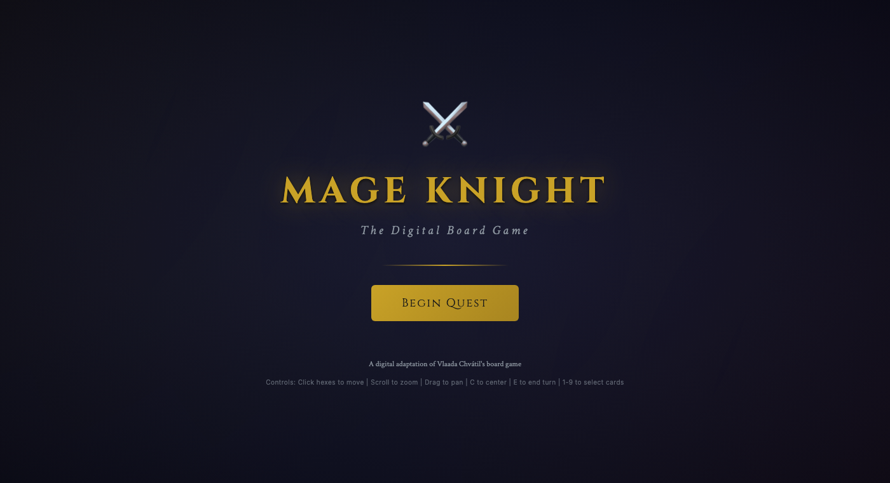
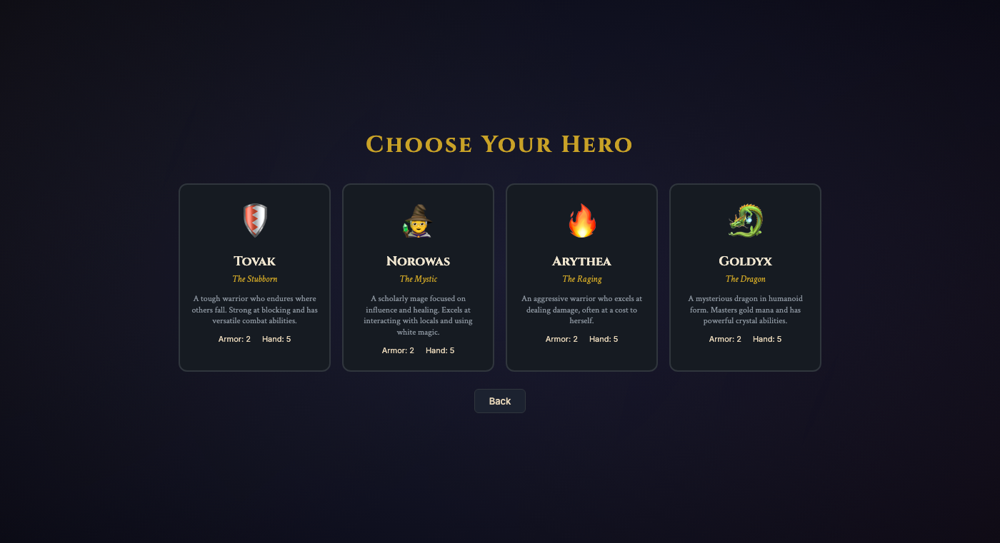
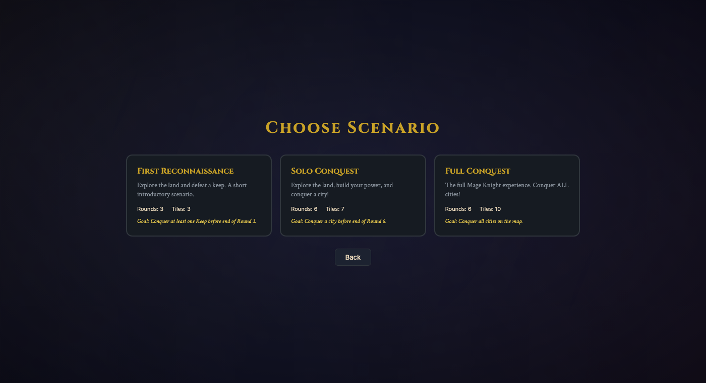
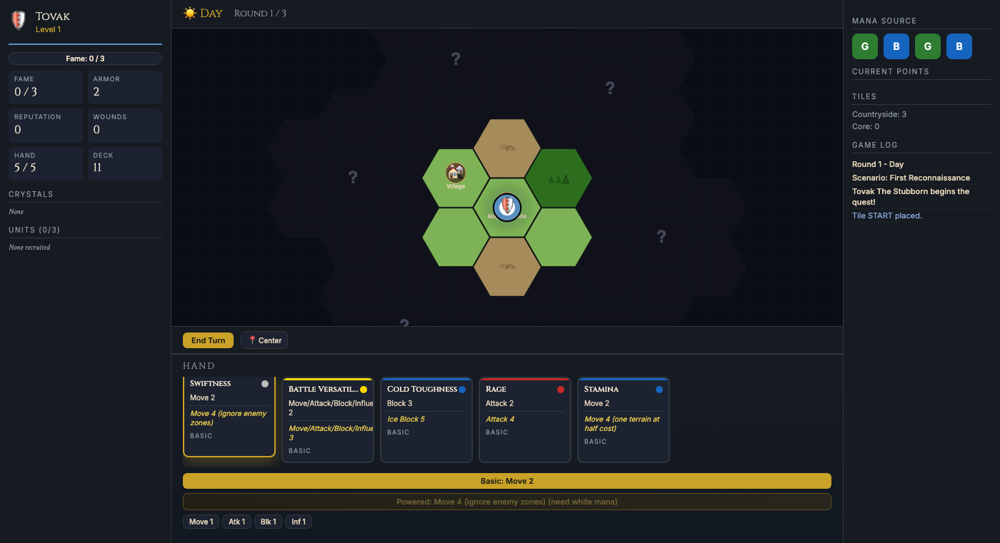

# Mage Knight

[](https://mintlify.com/npow/mage-knight)

A solo conquest game of exploration, combat, and deck building set in the Atlantean lands. Lead a powerful Mage Knight deep into uncharted territory — conquering keeps, raiding dungeons, fighting dragons, and commanding armies — as day turns to night and the land reveals its secrets one hex at a time.

Based on the board game by Vlaada Chvátil, published by WizKids.



## The Game

You are a Mage Knight, one of the most powerful beings in the land. You carry a deck of action cards that let you march across the countryside, smash through enemy defenses, influence local villages, and channel mana into devastating spells. Every card in your hand is a decision: play it for a basic effect, burn mana to power it up, or toss it sideways for a single point of whatever you need most right now.

The map starts as a single tile. Move to the edge and new terrain unfolds — forests with layered tree canopies, rolling hills with contour lines, snow-capped mountain peaks, gently rippling lakes, and eventually the fortified cities you've come to conquer. Gold tile boundaries mark where one map tile ends and the next begins. Every hex costs movement, and the costs change when the sun goes down — night casts a blue pall over the land and flips gold mana to black.

Combat runs in phases, tracked by a progress bar: **Ranged → Block → Damage → Attack → Resolve**. A damage visualization shows exactly how much incoming damage you face, how much you've blocked, and how many wounds are coming through. Enemies display their armor as pip bars and their abilities as tooltip badges — no more guessing what "fortified" means. Phase-specific warnings flash when enemies have relevant abilities.

Between fights you level up (with animated notifications), learn skills, gain advanced actions and spells, recruit units at villages, and collect mana crystals from mines. A turn guidance strip at the top shows your current phase — **Play Cards → Move → Interact → End Turn** — with contextual hints so you always know what to do next.

## Screenshots

| Title Screen | Hero Select |
|:---:|:---:|
|  |  |

| Scenario Select | Card Actions |
|:---:|:---:|
|  |  |

## Features

- **Canvas-drawn icons** — All site, enemy, hero, and UI icons are vector-drawn on canvas. No emoji, no external assets. Consistent rendering across all platforms.
- **Rich terrain textures** — Procedurally generated with deterministic seeding: layered forests, contoured hills, rocky mountains with snow caps, animated water ripples, murky swamp pools with dead stumps, cracked wastelands, windswept desert dunes, and subtle grass strokes on plains.
- **Turn guidance system** — Phase strip shows where you are in the turn. Contextual hints explain what you can do. No more staring at the screen wondering what's next.
- **MK-style card design** — Thick colored side borders, parchment name bar, split basic/powered effect sections with type icons, glowing mana dots.
- **Combat phase bar** — Visual progress through combat phases with damage visualization, armor pip bars, ability badges with tooltips, and phase-specific enemy warnings.
- **Notifications** — Animated overlay toasts for level-ups, round transitions (dawn/night), and major events.
- **Tile boundaries** — Gold lines between map tiles so you can see the tile grid at a glance.
- **Night mode** — Blue tint overlay dims the map when the sun goes down.
- **Interactive site glow** — Pulsing gold ring when your hero stands on an interactive site.

## Heroes

- **Tovak the Stubborn** — Defensive specialist. Endures where others fall. Starts with Ice Block and Battle Versatility.
- **Norowas the Mystic** — Influence and healing. Gets along with the locals. Starts with Noble Manners and Shield Mastery.
- **Arythea the Raging** — All offense, all the time. Burns bright and sometimes burns herself. Starts with Dark Fire and Battle Frenzy.
- **Goldyx the Dragon** — Master of gold mana and crystals. Mysterious and powerful. Starts with Will of Gold and Golden Greed.

## Scenarios

- **First Reconnaissance** — 3 rounds, Easy. Explore the land and conquer a keep. The introductory scenario.
- **Solo Conquest** — 6 rounds, Medium. Build your power and conquer a city before time runs out.
- **Full Conquest** — 6 rounds, Hard. Conquer every city on the map. Good luck.

## Playing

```
python3 -m http.server 8085
open http://localhost:8085
```

Click hexes to move. Play cards from your hand for movement, combat, influence, or healing. Scroll to zoom, drag to pan. Press `C` to snap the camera back to your hero, `E` to end your turn, or `1`–`9` to select cards by position.

No install, no dependencies, no build step. Just a browser.

## Differences from the Physical Game

This is a faithful adaptation of the solo game, with some simplifications:

- Enemy spawns are randomized rather than drawn from token pools
- Unit recruitment uses a rotating offer rather than the full unit deck
- Some advanced enemy abilities (Summoner, Arcane) are simplified
- Artifacts are not yet implemented
- Multiplayer is not supported

The core loop — explore, fight, level, conquer — plays true to the original.

## Credits

[Mage Knight Board Game](https://boardgamegeek.com/boardgame/96848/mage-knight-board-game) designed by Vlaada Chvátil, published by WizKids. This is a fan project for personal use.

## License

This project is not affiliated with or endorsed by WizKids or the original designers.
